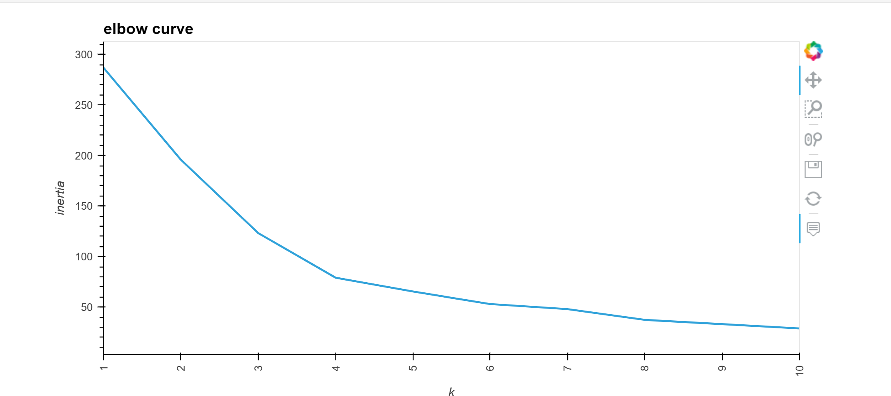

 # Using Unsupervised Learning to Analyze Cryptocurrency Performance.

This application uses Unsupervisied Machine Learning to analyze Cryptocurrency market data to improve investment portfolio performance.

### Data imported
Cryptocurrency market data over time.

    crypto_market_data.csv
  
---
## Technologies
### Python:

    Phyton Version: **3.7.13**

## Libraries and Dependencies

### hvplot
[hvplot](https://holoviz.org/tutorial/Composing_Plots.html)

### scikit-learn
[scikit-learn](https://scikit-learn.org/stable/testimonials/testimonials.html)

### K-Means
[k-Means](https://scikit-learn.org/stable/modules/clustering.html#k-means) 

### StandardScaler
[StandardScaler](https://scikit-learn.org/stable/modules/preprocessing.html?highlight=standard+scaler)

---
## Libraries and dependencies required 

        import pandas as pd
        import hvplot.pandas
        from pathlib import Path
        from sklearn.cluster import KMeans
        from sklearn.decomposition import PCA
        from sklearn.preprocessing import StandardScaler

## How to Run:
- Clone the repository on a folder and open it with Jupiter Lab Notebook

---
## Usage

### Elbow Curve - notice the K value of 4

### Cluster plot:

### Optimized Elbow Curve - note the K value of 4:

### Optimized Cluster plot:

---
<!--Contributors -->
## Contributors

- Startup code provided by UW FinTech Program

---
<!--License -->
## License
Tool is available under an MIT License.

## Aknowledgements
* [Markdown Guide](https://www.markdownguide.org/basic-syntax/#reference-style-links)

<!-- MARKDOWN LINKS & IMAGES -->
<!-- https://www.markdownguide.org/basic-syntax/#reference-style-links -->